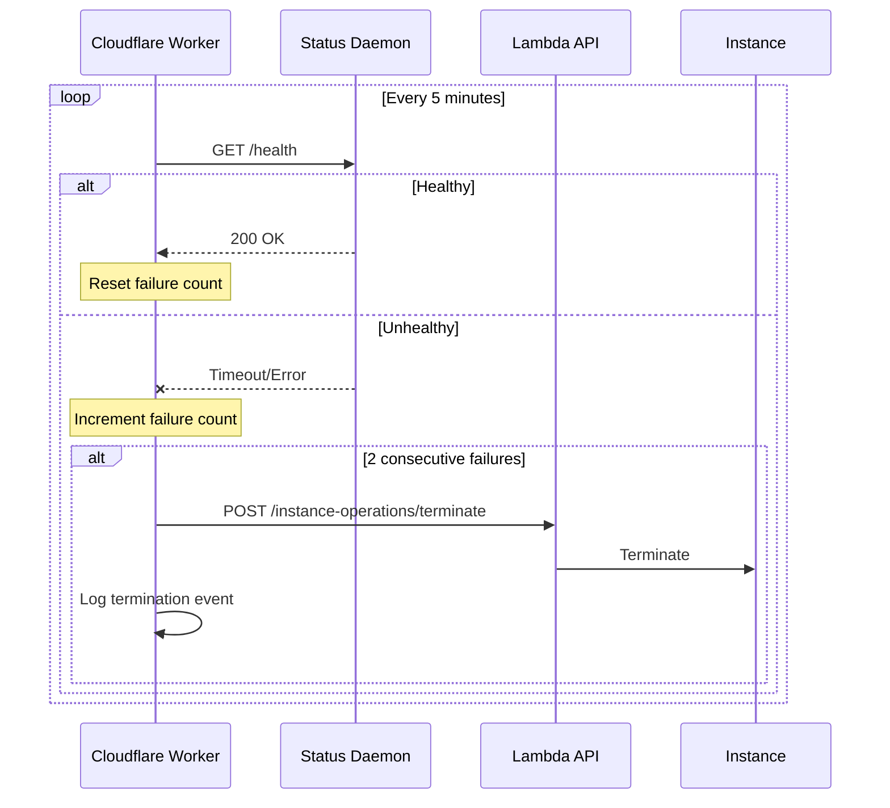
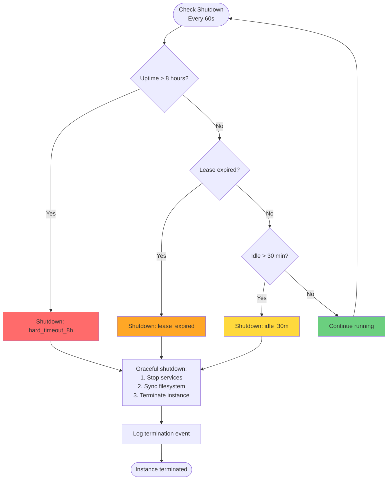

# Cost Controls

The soong CLI implements four layers of cost protection to prevent runaway expenses from GPU instances. These layers work together to provide defense-in-depth against forgotten instances, idle resources, and configuration errors.

## Overview

GPU instances on Lambda Labs cost $0.50-$2.00 per hour depending on GPU type. Without proper controls, a forgotten instance could rack up hundreds of dollars in charges. The multi-layered approach ensures that even if one layer fails, others will catch the issue.

## Layer 1: Idle Detection (30 Minutes)

**Purpose:** Automatically shut down instances that are not being actively used.

**How It Works:**

The status daemon on the GPU instance monitors activity signals:

- HTTP requests to SGLang API (port 8000)
- n8n workflow executions (port 5678)
- SSH connections to the instance
- Manual activity signals via `/activity` endpoint

If no activity is detected for 30 minutes, the daemon initiates a graceful shutdown.

**Activity Detection:**

```python
class ActivityMonitor:
    def __init__(self):
        self.last_activity = datetime.now()
        self.idle_timeout = timedelta(minutes=30)

    def signal_activity(self):
        """Reset idle timer."""
        self.last_activity = datetime.now()

    def check_idle(self):
        """Check if instance is idle."""
        elapsed = datetime.now() - self.last_activity
        return elapsed > self.idle_timeout
```

**Manual Activity Signal:**

```bash
# Keep instance alive during long-running batch jobs
curl -X POST \
  -H "Authorization: Bearer <token>" \
  http://<instance-ip>:8080/activity
```

**Bypass:**

Activity signals can be sent programmatically from batch jobs, notebooks, or scheduled tasks to prevent shutdown during legitimate long-running work.

## Layer 2: Lease System (4 Hours Default)

**Purpose:** Require explicit time commitment for instance usage.

**How It Works:**

When launching an instance, you specify a lease duration (default 4 hours). The instance will automatically shut down when the lease expires, regardless of activity.

**Lease Configuration:**

```yaml
# ~/.config/gpu-dashboard/config.yaml
defaults:
  lease_hours: 4  # Default lease duration
```

**Launch with Custom Lease:**

```bash
# 2-hour lease for quick task
soong start --hours 2

# 8-hour lease for all-day work
soong start --hours 8
```

**Extending Leases:**

Leases can be extended before they expire:

```bash
# Extend by 2 hours
soong extend 2
```

Or via the web dashboard at http://localhost:8092.

**Lease Limits:**

- **Minimum:** 1 hour
- **Maximum:** 8 hours (combined initial + extensions)
- **Default:** 4 hours (good balance of flexibility and safety)

**Implementation:**

```python
class LeaseManager:
    def __init__(self, initial_hours: int):
        self.created_at = datetime.now()
        self.shutdown_at = self.created_at + timedelta(hours=initial_hours)
        self.max_hours = 8

    def extend(self, hours: int) -> bool:
        """Extend lease if within max."""
        total_hours = (self.shutdown_at - self.created_at).total_seconds() / 3600
        if total_hours + hours > self.max_hours:
            return False  # Would exceed maximum

        self.shutdown_at += timedelta(hours=hours)
        return True

    def is_expired(self) -> bool:
        """Check if lease expired."""
        return datetime.now() > self.shutdown_at
```

## Layer 3: Hard Timeout (8 Hours Maximum)

**Purpose:** Absolute upper bound on instance lifetime.

**How It Works:**

Regardless of lease extensions or activity, every instance has a hard timeout of 8 hours from creation. After 8 hours, the instance will terminate even if:

- The lease has been extended multiple times
- The instance is actively processing requests
- Manual activity signals are being sent

**Rationale:**

This prevents:

- Accidental "extend forever" loops from scripts
- Misconfigured monitoring that keeps instances alive
- Forgetting to shut down after a long session

**Implementation:**

```python
def check_shutdown_conditions(self):
    """Determine if instance should shut down."""
    uptime = datetime.now() - self.created_at

    # Hard timeout: 8 hours absolute maximum
    if uptime > timedelta(hours=8):
        self.shutdown(reason="hard_timeout_8h")
        return True

    # Lease expiration
    if datetime.now() > self.shutdown_at:
        self.shutdown(reason="lease_expired")
        return True

    # Idle timeout
    if self.is_idle() and self.idle_elapsed() > timedelta(minutes=30):
        self.shutdown(reason="idle_30m")
        return True

    return False
```

**Override:**

There is no override for the hard timeout. If you need more than 8 hours of continuous GPU time, you must:

1. Launch a new instance
2. Migrate work to the new instance
3. Terminate the old instance

This is intentional to prevent infinite-running instances.

## Layer 4: Cloudflare Watchdog (Optional)

**Purpose:** External monitoring to catch instances that fail to self-terminate.

**How It Works:**

A Cloudflare Worker monitors the status daemon health endpoint every 5 minutes. If the health check fails 2 consecutive times, the worker terminates the instance via the Lambda API.

**Health Check Flow:**



**Failure Scenarios Detected:**

1. Status daemon crashed or stopped
2. Instance became unresponsive (network issue)
3. Instance frozen or deadlocked
4. Status daemon failed to self-terminate

**Implementation:**

The watchdog is implemented as a Cloudflare Worker (not included in this repo):

```javascript
// Cloudflare Worker (conceptual)
const HEALTH_CHECK_INTERVAL = 5 * 60 * 1000; // 5 minutes
const FAILURE_THRESHOLD = 2;

async function checkHealth(instanceIp, token) {
  try {
    const response = await fetch(
      `http://${instanceIp}:8080/health`,
      { headers: { Authorization: `Bearer ${token}` } }
    );
    return response.ok;
  } catch (error) {
    return false;
  }
}

async function handleHealthCheck(instanceId, instanceIp) {
  const healthy = await checkHealth(instanceIp, STATUS_TOKEN);

  if (!healthy) {
    failures[instanceId] = (failures[instanceId] || 0) + 1;

    if (failures[instanceId] >= FAILURE_THRESHOLD) {
      await terminateInstance(instanceId);
      await logTerminationEvent(instanceId, 'watchdog');
      delete failures[instanceId];
    }
  } else {
    failures[instanceId] = 0;
  }
}
```

**Setup:**

The watchdog is optional and requires:

1. Cloudflare Workers account
2. Lambda API key stored in worker secrets
3. Status daemon token shared between CLI and worker
4. Worker deployed with scheduled trigger (5 min)

**Benefits:**

- External monitoring (not dependent on instance)
- Catches cases where status daemon fails
- Provides termination history via worker KV store
- Low cost (<$1/month for typical usage)

## Shutdown Decision Flowchart



## Termination Events

All terminations are logged with the following information:

```json
{
  "timestamp": "2025-01-01T14:30:00Z",
  "instance_id": "inst_abc123",
  "event_type": "termination",
  "reason": "idle_30m",
  "uptime_minutes": 125,
  "gpu_type": "gpu_1x_a100_sxm4_80gb",
  "region": "us-west-1"
}
```

**Termination Reasons:**

| Reason | Description | Layer |
|--------|-------------|-------|
| `idle_30m` | No activity for 30 minutes | Layer 1 |
| `lease_expired` | Lease duration reached | Layer 2 |
| `hard_timeout_8h` | 8-hour maximum runtime | Layer 3 |
| `watchdog` | Cloudflare watchdog detected failure | Layer 4 |
| `manual` | User terminated via CLI or dashboard | User action |

**Viewing History:**

```bash
# Show last 24 hours of terminations
soong status --history

# Show last 7 days
soong status --history --history-hours 168
```

## Cost Estimation

The CLI shows cost estimates before launching instances:

```bash
$ soong start --model deepseek-r1-70b

Cost Estimate
━━━━━━━━━━━━━━━━━━━━━━━━━━━━━━━━━━━━━━
GPU: 1x A100 SXM4 (80 GB)
Rate: $1.29/hr
Duration: 4 hours

Estimated cost: $5.16
━━━━━━━━━━━━━━━━━━━━━━━━━━━━━━━━━━━━━━

Proceed with launch? [Y/n]:
```

**Cost Calculations:**

```python
def estimate_cost(gpu_type: str, hours: int) -> float:
    """Estimate cost for instance lease."""
    pricing = api.get_instance_type(gpu_type)
    hourly_rate = pricing.price_per_hour
    return hourly_rate * hours

def show_cost_estimate(gpu_type, hours):
    """Display cost estimate and get confirmation."""
    cost = estimate_cost(gpu_type, hours)
    console.print(Panel(
        f"GPU: {gpu_type.description}\n"
        f"Rate: ${gpu_type.price_per_hour:.2f}/hr\n"
        f"Duration: {hours} hours\n\n"
        f"[bold yellow]Estimated cost: ${cost:.2f}[/bold yellow]"
    ))
    return questionary.confirm("Proceed with launch?").ask()
```

## Real-Time Cost Tracking

The status command shows accumulated costs:

```bash
$ soong status

GPU Instances
━━━━━━━━━━━━━━━━━━━━━━━━━━━━━━━━━━━━━━━━━━━━━━━━━━━━━━
ID       Status  Uptime    Time Left  Cost Now  Est. Total
────────────────────────────────────────────────────────
inst_abc active  2h 15m    1h 45m     $2.91     $5.16
━━━━━━━━━━━━━━━━━━━━━━━━━━━━━━━━━━━━━━━━━━━━━━━━━━━━━━
```

**Columns Explained:**

- **Uptime**: Time since instance launched
- **Time Left**: Time until lease expires
- **Cost Now**: Current accumulated cost (uptime × hourly rate)
- **Est. Total**: Estimated total cost if lease runs to completion

**Expired Leases:**

When a lease expires, the time left shows in red:

```
Time Left: [red]EXPIRED[/red]
Cost Now: [red]$6.45[/red]  # Still accruing!
```

This indicates the instance should have shut down but hasn't. Possible causes:

- Status daemon failed
- Network issue preventing termination
- Manual override

**Action:** Manually terminate the instance to stop charges.

## Best Practices

### For Development Sessions

```bash
# Short exploratory work (2 hours)
soong start --hours 2

# Full development session (6 hours)
soong start --hours 6

# Extend if you need more time
soong extend 2
```

### For Batch Jobs

```python
# Keep instance alive during processing
import requests

def keep_alive(instance_ip, token):
    """Signal activity every 20 minutes."""
    while processing:
        requests.post(
            f"http://{instance_ip}:8080/activity",
            headers={"Authorization": f"Bearer {token}"}
        )
        time.sleep(20 * 60)  # 20 minutes
```

### For Long-Running Tasks

If you need more than 8 hours:

1. **Break into chunks**: Design tasks to complete in <8 hour segments
2. **Save checkpoints**: Persist state to filesystem between instances
3. **Use queues**: Submit work items to a queue, process in batches
4. **Consider dedicated instances**: For truly long-running work, use Lambda's dedicated instances (not via this CLI)

### Cost Monitoring

Set up alerting for costs:

1. **Lambda billing alerts**: Configure in Lambda dashboard
2. **History monitoring**: Check `soong status --history` daily
3. **Budget tracking**: Set monthly GPU budget and track spending

## Emergency Shutdown

If you suspect an instance is running but shouldn't be:

```bash
# List all instances
soong status

# Terminate immediately
soong stop --yes
```

Or via Lambda dashboard:

1. Go to https://cloud.lambdalabs.com/instances
2. Find the instance
3. Click "Terminate"

## Testing Cost Controls

**Idle timeout test:**

```bash
# Launch instance
soong start --hours 1

# Wait 30 minutes without activity
# Instance should auto-terminate
```

**Lease expiration test:**

```bash
# Launch with 1-hour lease
soong start --hours 1

# Keep sending activity signals
while true; do
  curl -X POST -H "Authorization: Bearer <token>" \
    http://<ip>:8080/activity
  sleep 10m
done

# Instance should still terminate after 1 hour
```

**Hard timeout test:**

```bash
# Launch instance
soong start --hours 4

# Extend multiple times
soong extend 2  # Total: 6 hours
soong extend 2  # Total: 8 hours
soong extend 1  # Should fail (exceeds maximum)

# Keep instance active
# Should terminate after 8 hours regardless
```

## Troubleshooting

### Instance Didn't Shut Down

**Check status daemon:**

```bash
ssh ubuntu@<instance-ip>
systemctl status status-daemon
journalctl -u status-daemon -n 50
```

**Manually terminate:**

```bash
soong stop --yes
```

### Lease Extension Failed

**Common causes:**

1. Would exceed 8-hour maximum
2. Lease already expired
3. Instance unreachable

**Check total hours:**

```bash
soong status
# Look at "Time Left" and "Uptime" to calculate total
```

### Costs Higher Than Expected

**Review history:**

```bash
soong status --history --history-hours 168
```

**Check for:**

- Instances that ran longer than expected
- Multiple simultaneous instances
- Instances that didn't auto-terminate

## Implementation Reference

Key files implementing cost controls:

- `cli/src/soong/cli.py` - Cost estimation, confirmation prompts
- Status daemon (on instance) - Idle detection, lease management, hard timeout
- Cloudflare Worker (optional) - External watchdog monitoring

## Future Improvements

Planned enhancements to cost controls:

1. **Predictive cost alerts**: Warn when approaching budget limits
2. **Usage quotas**: Per-user or per-project spending limits
3. **Scheduled shutdowns**: Auto-terminate at specific times (e.g., end of business day)
4. **Cost optimization**: Automatic GPU selection for cost/performance
5. **Shared instances**: Multi-user access to reduce per-user costs
