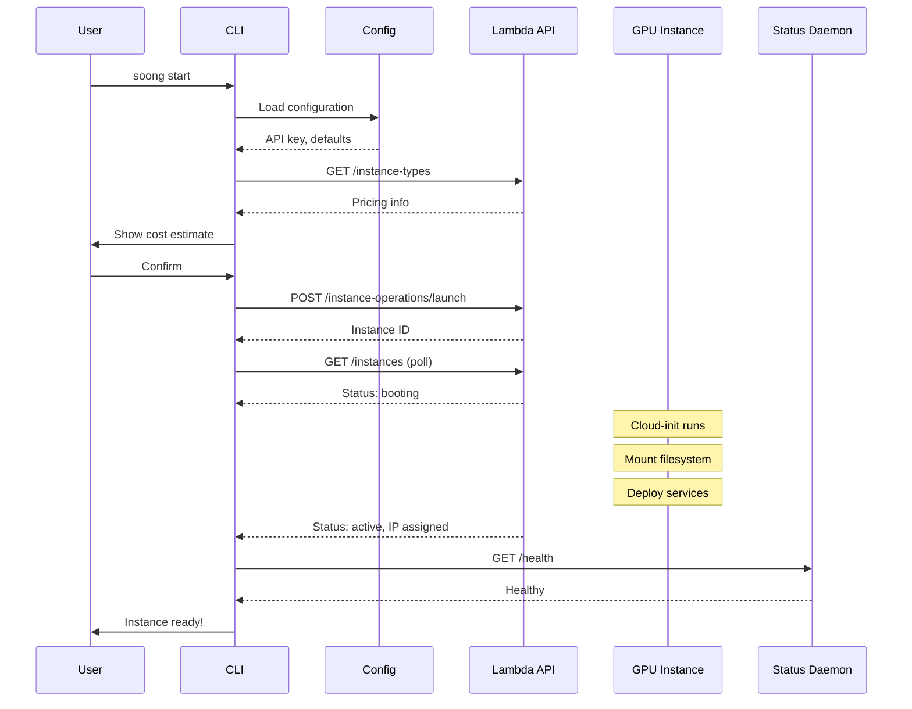
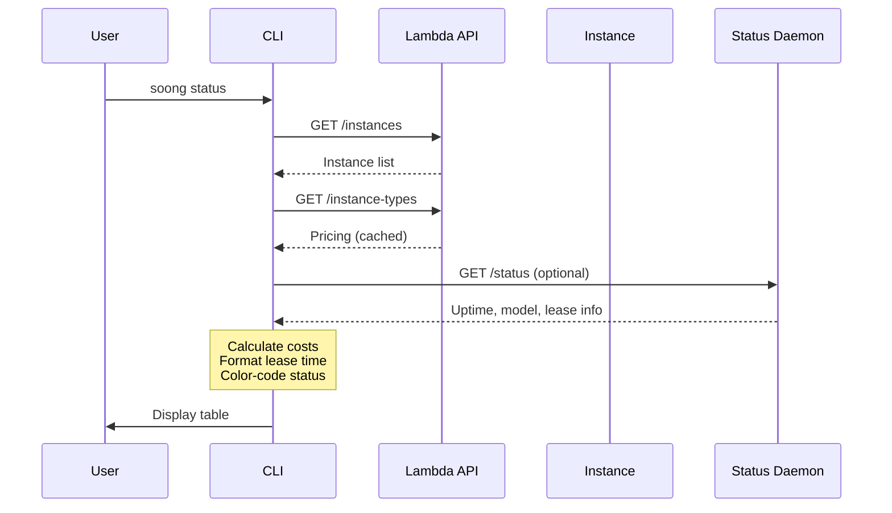

# System Design

This document describes the overall architecture of the soong CLI system, including component interactions, data flow, and design decisions.

## High-Level Architecture

```mermaid
graph TB
    subgraph "Local Machine"
        CLI[CLI Tool<br/>soong]
        Config[Config Manager<br/>~/.config/gpu-dashboard/]
        SSHMgr[SSH Tunnel Manager]

        CLI --> Config
        CLI --> SSHMgr
    end

    subgraph "Lambda Labs API"
        API[REST API<br/>cloud.lambdalabs.com]
    end

    subgraph "GPU Instance"
        StatusD[Status Daemon<br/>:8080]
        SGLang[SGLang Server<br/>:8000]
        N8N[n8n Workflows<br/>:5678]

        StatusD -.monitors.-> SGLang
        StatusD -.monitors.-> N8N
    end

    subgraph "Persistent Storage"
        FS[Lambda Filesystem<br/>/lambda/nfs/coding-stack/]
        Secrets[secrets/env.sh]
        Projects[projects/]

        FS --> Secrets
        FS --> Projects
    end

    CLI -->|Launch/Terminate| API
    CLI -->|Status Query| API
    CLI -->|SSH/Tunnel| StatusD

    API -->|Provision| GPU Instance
    GPU Instance -->|Mount| FS

    style CLI fill:#e1f5ff
    style StatusD fill:#fff3e0
    style API fill:#f3e5f5
    style FS fill:#e8f5e9
```

## Component Details

### CLI Tool

**Location:** `cli/src/soong/cli.py`

**Responsibilities:**

- Parse user commands and arguments
- Load configuration from YAML
- Invoke Lambda API via LambdaAPI client
- Manage SSH tunnels
- Display rich terminal output

**Key Features:**

- Interactive configuration wizard with intelligent defaults
- Cost estimation before instance launch
- Rich table display with color-coded status
- Progress indicators for long-running operations
- GPU/model recommendation system

**Entry Point:**

```python
@app.command()
def start(
    model: Optional[str] = None,
    gpu: Optional[str] = None,
    region: Optional[str] = None,
    hours: Optional[int] = None,
    name: Optional[str] = None,
):
    """Launch new GPU instance."""
```

### Lambda API Client

**Location:** `cli/src/soong/lambda_api.py`

**Responsibilities:**

- HTTP communication with Lambda Labs API
- Retry logic with exponential backoff
- Response parsing and error handling
- Instance lifecycle operations

**Retry Strategy:**

```python
RETRY_MAX_ATTEMPTS = 3
RETRY_BASE_DELAY = 1
RETRY_BACKOFF_MULTIPLIER = 2

# Delays: 1s, 2s, 4s
```

**Endpoints:**

| Endpoint | Method | Purpose |
|----------|--------|---------|
| `/instances` | GET | List all instances |
| `/instance-operations/launch` | POST | Launch new instance |
| `/instance-operations/terminate` | POST | Terminate instance |
| `/instance-types` | GET | List GPU types with pricing |
| `/ssh-keys` | GET | List SSH keys |

### Instance Manager

**Location:** `cli/src/soong/instance.py`

**Responsibilities:**

- Wait for instance to become ready
- Poll instance status
- Find active instances

**Ready Criteria:**

An instance is considered ready when:

1. Status is `active`
2. IP address is assigned
3. Not in terminal state (`terminated`, `unhealthy`)

**Polling Logic:**

```python
def wait_for_ready(instance_id: str, timeout_seconds: int = 600):
    poll_interval = 10  # seconds
    while elapsed < timeout_seconds:
        instance = api.get_instance(instance_id)
        if instance.status == "active" and instance.ip:
            return instance
        time.sleep(poll_interval)
```

### SSH Tunnel Manager

**Location:** `cli/src/soong/ssh.py`

**Responsibilities:**

- Start background SSH tunnels with port forwarding
- Stop tunnels gracefully
- Track tunnel PID for cleanup
- Interactive SSH sessions

**Port Forwarding:**

```bash
ssh -N -f \
  -L 8000:localhost:8000 \  # SGLang
  -L 5678:localhost:5678 \  # n8n
  -L 8080:localhost:8080 \  # Status daemon
  -i ~/.ssh/id_rsa \
  ubuntu@<instance-ip>
```

**PID Tracking:**

Tunnel process ID stored in `~/.config/gpu-dashboard/tunnel.pid` for cleanup.

### Configuration Manager

**Location:** `cli/src/soong/config.py`

**Responsibilities:**

- Load/save YAML configuration
- Validate custom model definitions
- Secure file permissions

**Configuration Schema:**

```yaml
lambda:
  api_key: string          # Lambda API key
  default_region: string   # e.g., "us-west-1"
  filesystem_name: string  # e.g., "coding-stack"

status_daemon:
  token: string            # Shared secret
  port: int                # Default: 8080

defaults:
  model: string            # Default model ID
  gpu: string              # Default GPU type
  lease_hours: int         # Default: 4

ssh:
  key_path: string         # SSH private key path

custom_models:
  <model-id>:
    hf_path: string
    params_billions: float
    quantization: string
    context_length: int
```

### Status Daemon

**Location:** On GPU instance (deployed via cloud-init)

**Responsibilities:**

- Health monitoring
- Lease management
- Idle detection
- Activity tracking
- Graceful shutdown

**API Endpoints:**

| Endpoint | Method | Purpose |
|----------|--------|---------|
| `/health` | GET | Health check |
| `/status` | GET | Instance status |
| `/extend` | POST | Extend lease |
| `/shutdown` | POST | Graceful shutdown |
| `/activity` | POST | Signal activity |

**Authentication:**

All endpoints require `Authorization: Bearer <token>` header.

## Data Flow: Instance Launch



### Launch Steps

1. **User initiates launch**
   - Command: `soong start --model deepseek-r1-70b`
   - CLI loads configuration from YAML

2. **API preparation**
   - Fetch instance types for pricing
   - Show cost estimate and get confirmation
   - Validate SSH keys exist in account

3. **Instance provisioning** (Lambda API)
   - POST to `/instance-operations/launch`
   - Payload includes region, GPU type, SSH keys, filesystem
   - API returns instance ID immediately

4. **Polling for ready state**
   - Poll `/instances` every 10 seconds
   - Wait for status `active` and IP assignment
   - Timeout after 600 seconds (10 minutes)

5. **Bootstrap completion** (cloud-init on instance)
   - Mount persistent filesystem
   - Load secrets from `/lambda/nfs/coding-stack/secrets/`
   - Deploy SGLang, n8n, status daemon
   - Start monitoring

6. **Confirmation**
   - CLI displays instance IP
   - Shows SSH and status commands
   - User can connect via `soong ssh`

## Data Flow: Status Query



### Status Information Sources

1. **Lambda API** (required)
   - Instance ID, name, status
   - IP address
   - GPU type, region
   - Created timestamp
   - Lease expiration

2. **Pricing API** (optional, cached)
   - Hourly rate for GPU type
   - Cost calculations

3. **Status Daemon** (optional)
   - Current uptime
   - Loaded model
   - Last activity timestamp
   - Shutdown time

### Cost Calculations

```python
# Current cost
uptime_hours = (now - created_at).total_seconds() / 3600
current_cost = hourly_rate * uptime_hours

# Estimated total
lease_hours = (lease_expires_at - created_at).total_seconds() / 3600
total_cost = hourly_rate * lease_hours
```

## Security Model

### Authentication Layers

1. **Lambda API**: Bearer token authentication
   - API key stored in `~/.config/gpu-dashboard/config.yaml` (mode 0600)
   - Never logged or displayed
   - Passed in `Authorization` header

2. **Status Daemon**: Shared secret authentication
   - Token generated during configuration (32-byte URL-safe)
   - Stored in config and deployed to instance
   - Required for all daemon endpoints

3. **SSH Access**: Key-based authentication
   - Private key path configurable
   - SSH keys managed in Lambda account
   - Tunnel uses `-o StrictHostKeyChecking=no` for automation

### Secret Management

**Local secrets:**

- `~/.config/gpu-dashboard/config.yaml` (mode 0600)
- Contains API keys, tokens, SSH key paths

**Instance secrets:**

- `/lambda/nfs/coding-stack/secrets/env.sh`
- Sourced by services during startup
- Contains Anthropic API keys, service tokens

### Network Security

**Inbound:**

- Lambda instances have public IPs
- SSH (port 22) open for management
- Services (8000, 5678, 8080) open for development
- Production deployments should use VPC

**Outbound:**

- No restrictions
- Services make API calls (OpenAI, Anthropic, etc.)
- Metrics/monitoring can send to external services

## Performance Considerations

### API Rate Limiting

Lambda API has rate limits (undocumented). The client implements:

- Exponential backoff on errors
- Caching of instance types (pricing)
- Efficient polling intervals (10s)

### Instance Boot Time

Typical boot sequence:

1. Instance provisioning: 30-60 seconds
2. Cloud-init execution: 2-3 minutes
3. Service deployment: 3-5 minutes
4. Model loading (SGLang): 2-5 minutes

**Total:** 7-14 minutes for ready state

### Filesystem Mounting

Persistent filesystem mount is fast (1-2 seconds) because Lambda uses high-performance NFS.

## Error Handling

### API Errors

**Transient errors** (retry with backoff):

- Network timeouts
- 5xx server errors
- Rate limiting (429)

**Permanent errors** (fail immediately):

- Invalid API key (401)
- Resource not found (404)
- Insufficient quota (403)

### Instance States

**Terminal states** (stop polling):

- `terminated`
- `unhealthy`

**Transient states** (keep polling):

- `booting`
- `pending`
- `active` (without IP yet)

### SSH Tunnel Errors

**Common failures:**

- Port already in use (tunnel exists)
- Connection refused (instance not ready)
- Authentication failure (wrong key)

**Recovery:**

- Check tunnel status before starting
- Stop existing tunnel automatically
- Verify instance has IP before connecting

## Deployment Considerations

### Local Development

```bash
cd cli
pip install -e ".[test]"
soong configure
```

### Production Usage

For production deployments, consider:

1. **VPC networking** for private instance access
2. **Cloudflare Workers** for watchdog monitoring
3. **Secrets management** via environment variables
4. **Log aggregation** for debugging
5. **Cost alerts** for budget monitoring

### Multi-User Setup

The CLI is designed for single-user workstations. For multi-user scenarios:

- Each user needs their own `~/.config/gpu-dashboard/`
- Shared Lambda account (API key) or separate accounts
- Filesystem naming convention (e.g., `coding-stack-{username}`)
- Cost tracking per user via instance naming

## Monitoring and Observability

### CLI Logging

The CLI uses Rich console for output:

- Color-coded status (green=success, red=error, yellow=warning)
- Progress spinners for long operations
- Tables for structured data

### Instance Logs

On the GPU instance:

- `/var/log/gpu-stack-boot.log` - Cloud-init execution
- `journalctl -u sglang` - SGLang service logs
- `journalctl -u n8n` - n8n workflow logs
- `journalctl -u status-daemon` - Status daemon logs

### Health Checks

**Status daemon health:**

```bash
curl -H "Authorization: Bearer <token>" \
  http://<instance-ip>:8080/health
```

**Service health:**

- SGLang: `curl http://localhost:8000/health`
- n8n: `curl http://localhost:5678/healthz`

## Future Enhancements

### Planned Features

1. **Instance pools**: Manage multiple instances
2. **Snapshot support**: Save instance state
3. **GPU sharing**: Multi-tenant GPU access
4. **Cost analytics**: Historical spending reports
5. **Automatic model selection**: Based on task requirements

### Scalability

The current design supports:

- Single user managing 1-10 instances
- Manual orchestration of services

For larger deployments:

- Consider Kubernetes for orchestration
- Implement instance pool management
- Add cost allocation and chargebacks
- Integrate with existing DevOps tooling
