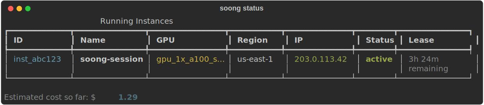

# Quick Start

This 5-minute tutorial will walk you through launching your first GPU instance, connecting via SSH, and stopping the instance.

---

## Prerequisites

Before starting this tutorial, make sure you've completed:

- [x] [Prerequisites](prerequisites.md) - Lambda Labs account setup
- [x] [Installation](installation.md) - Soong CLI installed
- [x] [Configuration](configuration.md) - CLI configured with credentials

---

## Step 1: Browse Available Models

First, let's see what models are available:

```bash
soong models --limit 10
```

**Expected Output**:
```
Available models (showing 10 of 150):

Name                                    VRAM Required
--------------------------------------  --------------
meta-llama/Llama-2-7b-hf               14 GB
mistralai/Mistral-7B-v0.1              14 GB
meta-llama/Llama-2-13b-hf              26 GB
deepseek-ai/DeepSeek-R1                160 GB
meta-llama/Meta-Llama-3-70B            140 GB
...
```

!!! tip "Model Recommendations"
    Use `soong models --recommend <model-name>` to get instance type recommendations based on VRAM requirements.

**Example**:
```bash
soong models --recommend meta-llama/Llama-2-7b-hf
```

**Output**:
```
Model: meta-llama/Llama-2-7b-hf
Estimated VRAM: 14 GB

Recommended instance types:
✓ gpu_1x_a10 (24GB VRAM) - $0.60/hr
✓ gpu_1x_a100 (40GB VRAM) - $1.10/hr
✓ gpu_1x_h100_pcie (80GB VRAM) - $2.99/hr
```

---

## Step 2: Start a GPU Instance

Launch a GPU instance with your chosen model:

```bash
soong start --model meta-llama/Llama-2-7b-hf
```

**What happens**:

1. Soong CLI requests an instance from Lambda Labs
2. Lambda Labs provisions the GPU instance
3. The instance boots and becomes accessible
4. SSH tunnels are automatically configured
5. Your persistent filesystem is mounted (if configured)

**Expected Output**:
```
Starting GPU instance...
Instance type: gpu_1x_a10 (using default)
Region: us-west-1 (using default)
Max runtime: 2 hours (using default)

✓ Instance started successfully!

Instance Details:
  ID: i-abc123def456
  Type: gpu_1x_a10
  Status: running
  IP: 203.0.113.42
  Cost: $0.60/hour

SSH Tunnels:
  Local Port 8000 → Instance Port 8000 (SGLang)
  Local Port 5678 → Instance Port 5678 (n8n)
  Local Port 8080 → Instance Port 8080 (Status Daemon)

To connect: soong ssh
To check status: soong status
To stop: soong stop
```

!!! info "Instance Startup Time"
    Instances typically take 30-60 seconds to become fully ready. You'll see a "running" status once it's accessible.

### Customize Instance Launch

You can override defaults with command-line flags:

```bash
# Specify instance type
soong start --model meta-llama/Llama-2-7b-hf --instance-type gpu_1x_a100

# Set max runtime to 4 hours
soong start --model meta-llama/Llama-2-7b-hf --max-hours 4

# Combine multiple options
soong start \
  --model deepseek-ai/DeepSeek-R1 \
  --instance-type gpu_1x_h100_pcie \
  --max-hours 6 \
  --region us-east-1
```

---

## Step 3: Check Instance Status

View your running instance details:

```bash
soong status
```



**Expected Output**:
```
Instance Status:
  ID: i-abc123def456
  Type: gpu_1x_a10
  Status: running
  Model: meta-llama/Llama-2-7b-hf

Runtime:
  Uptime: 5 minutes
  Max runtime: 2 hours
  Time remaining: 1 hour 55 minutes

Cost:
  Hourly rate: $0.60/hr
  Current cost: $0.05
  Estimated total (at 2hr): $1.20

Network:
  IP: 203.0.113.42
  SSH tunnels: Active

Ports:
  8000 (SGLang): Available at localhost:8000
  5678 (n8n): Available at localhost:5678
  8080 (Status): Available at localhost:8080
```

---

## Step 4: Connect via SSH

SSH into your running instance:

```bash
soong ssh
```

**What happens**:
1. Soong CLI connects using your configured SSH key
2. You're logged into the instance as the default user
3. Your persistent filesystem is mounted at `/home/ubuntu/workspace` (if configured)

**Expected Output**:
```
Connecting to instance i-abc123def456 (203.0.113.42)...

Welcome to Ubuntu 22.04.3 LTS (GNU/Linux 5.15.0-1048-aws x86_64)

 * Documentation:  https://help.ubuntu.com
 * Management:     https://landscape.canonical.com
 * Support:        https://ubuntu.com/advantage

ubuntu@lambda-instance:~$
```

### Verify GPU Access

Once connected, verify GPU access:

```bash
nvidia-smi
```

**Expected Output**:
```
+-----------------------------------------------------------------------------+
| NVIDIA-SMI 535.54.03    Driver Version: 535.54.03    CUDA Version: 12.2   |
|-------------------------------+----------------------+----------------------+
| GPU  Name        Persistence-M| Bus-Id        Disp.A | Volatile Uncorr. ECC |
| Fan  Temp  Perf  Pwr:Usage/Cap|         Memory-Usage | GPU-Util  Compute M. |
|===============================+======================+======================|
|   0  NVIDIA A10          Off  | 00000000:00:1E.0 Off |                    0 |
|  0%   32C    P0    52W / 150W |      0MiB / 24576MiB |      0%      Default |
+-------------------------------+----------------------+----------------------+
```

### Exit SSH Session

To return to your local machine:

```bash
exit
```

---

## Step 5: Access Services via SSH Tunnels

Soong CLI automatically sets up SSH tunnels to common ports. You can access these services from your local machine:

### SGLang Inference Server (Port 8000)

```bash
# From your local machine
curl http://localhost:8000/health
```

### n8n Workflow Automation (Port 5678)

Open in your browser:
```
http://localhost:5678
```

### Instance Status Daemon (Port 8080)

```bash
curl http://localhost:8080/status
```

!!! tip "Tunnel Management"
    SSH tunnels are automatically created when you start an instance. Use `soong tunnel` to manually manage tunnels if needed.

---

## Step 6: Extend Runtime (Optional)

If you need more time before the instance auto-stops:

```bash
soong extend --hours 2
```

**Expected Output**:
```
Extended instance runtime by 2 hours.

New Details:
  Current uptime: 45 minutes
  New max runtime: 4 hours
  Time remaining: 3 hours 15 minutes
  New estimated cost (at 4hr): $2.40
```

---

## Step 7: Stop the Instance

When you're done, stop the instance to avoid additional charges:

```bash
soong stop
```

**Expected Output**:
```
Stopping instance i-abc123def456...

✓ Instance stopped successfully!

Final Summary:
  Total runtime: 1 hour 23 minutes
  Total cost: $0.83

Instance data has been saved to your persistent filesystem.
```

!!! warning "Data Loss Warning"
    If you're NOT using a persistent filesystem, all data on the instance will be lost when stopped. Make sure to copy any important files before stopping.

---

## Complete Example Workflow

Here's a complete workflow from start to finish:

```bash
# 1. Check available models
soong models --limit 5

# 2. Get recommendations for a specific model
soong models --recommend meta-llama/Llama-2-7b-hf

# 3. Start instance with the model
soong start --model meta-llama/Llama-2-7b-hf

# 4. Check status
soong status

# 5. SSH into instance
soong ssh

# (Inside instance) Verify GPU
nvidia-smi

# (Inside instance) Do your work...
python train_model.py

# (Inside instance) Exit SSH
exit

# 6. (Optional) Extend runtime if needed
soong extend --hours 1

# 7. Stop instance when done
soong stop
```

---

## What's Next?

Now that you've launched your first instance, explore more features:

- **[Command Reference](../reference/cli-commands.md)**: Detailed documentation for all commands
- **[Configuration Reference](../reference/configuration-file.md)**: Advanced configuration options
- **[Model Management](../guides/model-management.md)**: Working with different models
- **[Cost Optimization](../guides/cost-optimization.md)**: Tips for reducing GPU costs

---

## Common Questions

### How much does this cost?

Costs depend on the instance type and runtime:

| Instance Type | VRAM | Cost/Hour | 2hr Session |
|--------------|------|-----------|-------------|
| gpu_1x_a10 | 24GB | $0.60 | $1.20 |
| gpu_1x_a100 | 40GB | $1.10 | $2.20 |
| gpu_1x_h100_pcie | 80GB | $2.99 | $5.98 |

See `soong available` for current pricing.

### What happens if I forget to stop an instance?

If you set `--max-hours`, the instance automatically stops when the time limit is reached. Without a time limit, the instance runs indefinitely until manually stopped.

!!! tip "Set a Max Runtime"
    Always use `--max-hours` to prevent unexpected costs from forgotten instances.

### Can I resume a stopped instance?

No, stopped instances cannot be resumed. You'll need to start a new instance. However, if you use a persistent filesystem, your data is preserved.

### How do I save my work between sessions?

Use a persistent filesystem (configured during setup). Any data stored in `/home/ubuntu/workspace` persists across instances.

---

!!! success "Congratulations!"
    You've successfully launched and managed your first GPU instance with Soong CLI!
