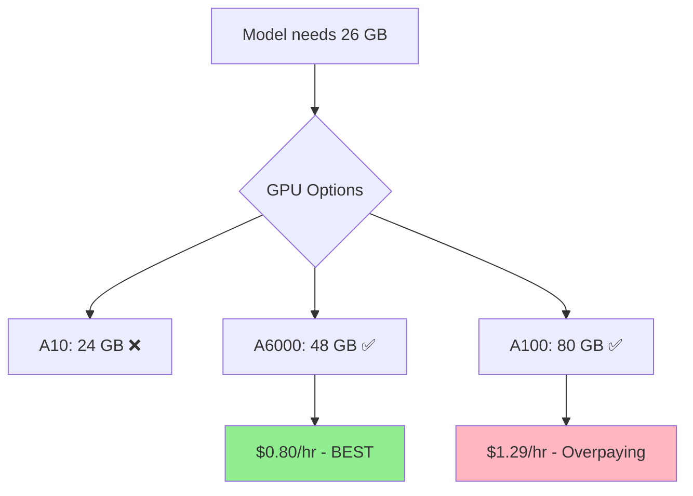
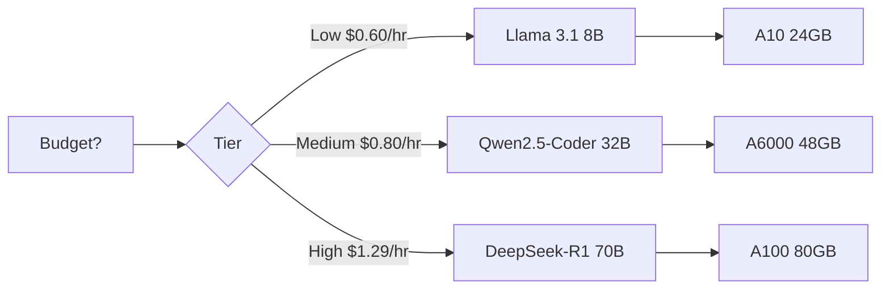
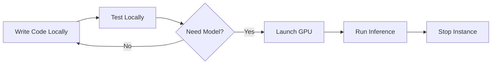

# Cost Optimization

Strategies to minimize GPU costs while maintaining productivity.

## Overview

GPU instances can be expensive ($0.60-$2.00+/hour). This guide shows how to optimize costs without sacrificing development quality.

## Cost Structure

Understanding the pricing model:

```
Total Cost = GPU Rate × Uptime Hours
```

**Key variables**:

- **GPU Rate**: Determined by GPU type ($0.60/hr for A10, $1.29/hr for A100)
- **Uptime Hours**: How long the instance runs

**Optimization targets**:

1. Choose the cheapest GPU that fits your model
2. Minimize unnecessary uptime

## GPU Selection Strategies

### Rule: Use the Smallest GPU That Fits



**Example**: Qwen2.5-Coder 32B INT4

- Needs: 26 GB VRAM
- ❌ A100 80GB ($1.29/hr): Overpaying by $0.49/hr
- ✅ A10 24GB (too small)
- ✅ A6000 48GB ($0.80/hr): **Best choice**

**Savings**: $0.49/hr × 4 hours = **$1.96 saved per session**

### Use INT4 When Quality Allows

Quantization reduces VRAM requirements, enabling cheaper GPUs:

| Model | Quantization | VRAM | GPU | Cost/hr | Quality Loss |
|-------|-------------|------|-----|---------|--------------|
| Qwen2.5-Coder 32B | FP16 | 46 GB | A6000 | $0.80 | 0% (baseline) |
| Qwen2.5-Coder 32B | INT4 | 26 GB | A10 | $0.60 | ~5% |

**Savings**: $0.20/hr × 4 hours = **$0.80 saved per session**

**When to use INT4**:

- ✅ Code generation and completion
- ✅ Simple refactoring
- ✅ Prototyping
- ❌ Production code review
- ❌ Complex reasoning tasks

### Model Selection by Budget



**Cost comparison** (4-hour session):

| Tier | Model | GPU | Session Cost |
|------|-------|-----|--------------|
| **Budget** | Llama 3.1 8B | A10 | $2.40 |
| **Medium** | Qwen2.5-Coder 32B INT4 | A10 | $2.40 |
| **Medium+** | Qwen2.5-Coder 32B | A6000 | $3.20 |
| **Premium** | DeepSeek-R1 70B | A100 | $5.16 |

**Strategy**: Start with medium tier (Qwen INT4), escalate to premium only when needed.

## Lease Management Strategies

### Use Shorter Initial Leases

Start with 2 hours, extend as needed:

```bash
# Start short
soong start --hours 2  # $1.60

# Extend if needed (only if still working)
soong extend 2  # +$1.60 total $3.20
```

**vs. starting with 4 hours**:

```bash
# Start long
soong start --hours 4  # $3.20

# Finish early, waste time
# (Stop after 2.5 hours, wasted $1.20)
```

**Savings**: Avoid paying for unused time.

### Monitor Lease Time

Set reminders to check status:

```bash
# Every hour
watch -n 3600 soong status
```

Or add to shell prompt:

```bash
# Add to ~/.bashrc or ~/.zshrc
gpu_status() {
  soong status 2>/dev/null | grep "Time Left" | awk '{print $NF}'
}

PS1='[GPU: $(gpu_status)] $ '
```

### Extend Before Expiration

Avoid unexpected termination:

```
Time Left: 45m  # Yellow warning
```

**Action**: Extend now, not at 5 minutes:

```bash
soong extend 2
```

## Development Workflow Optimization

### Batch Work Sessions

Instead of multiple small sessions, batch work:

```bash
# ❌ Inefficient: 3 separate sessions
Session 1: 1 hour ($0.80)
Session 2: 1.5 hours ($1.20)
Session 3: 0.5 hours ($0.40)
Total: 3 hours, 3 launches = $2.40

# ✅ Efficient: 1 combined session
Session 1: 3 hours ($2.40)
Total: 3 hours, 1 launch = $2.40
```

**Savings**: Avoid instance startup overhead (5-10 min per launch).

### Use Local Development First

Develop and test locally, use GPU only for model-specific work:



**Example workflow**:

1. Write code on laptop (free)
2. Write tests on laptop (free)
3. Launch GPU instance for inference testing
4. Stop instance immediately after

**Savings**: Minimize GPU uptime to only essential tasks.

### Stop Instances Between Sessions

Don't leave instances running overnight or during breaks:

```bash
# Before lunch
soong stop --yes

# After lunch
soong start
```

**Savings**: $0.80/hr × 1 hour lunch = **$0.80 saved**

## Idle Detection Configuration

The status daemon automatically stops instances after 30 minutes of inactivity.

### How It Works

The daemon monitors:

- CPU usage
- GPU utilization
- Network activity
- Active SSH sessions

**Idle = all metrics below threshold for 30 minutes**

### Benefits

- Prevents forgetting to stop instances
- No manual monitoring required
- Automatic cost control

### Limitations

**Not idle** if:

- Long-running training jobs
- Background processes
- Active SSH tunnel (even if not using)

**Solution**: Use lease limits (8 hours max) as hard stop.

## Cost Estimation

### Before Launch

Always review cost estimates:

```
┌─────────────────────────────────────┐
│ Launch Instance                     │
├─────────────────────────────────────┤
│                                     │
│ Cost Estimate                       │
│                                     │
│ GPU: 1x A6000 (48 GB)              │
│ Rate: $0.80/hour                   │
│ Duration: 4 hours                  │
│                                     │
│ Estimated cost: $3.20              │
│                                     │
└─────────────────────────────────────┘
```

**Skip if confident**:

```bash
soong start --yes
```

### During Session

Monitor current and estimated total costs:

```bash
soong status
```

```
┌────────────────────────────────────────────────────────────┐
│ ID   │ Uptime │ Time Left │ Cost Now │ Est. Total         │
├──────┼────────┼───────────┼──────────┼────────────────────┤
│ a1b2 │ 2h 30m │ 1h 30m    │ $2.00    │ $3.20              │
└────────────────────────────────────────────────────────────┘
```

- **Cost Now**: Amount spent so far
- **Est. Total**: Projected cost if lease runs to completion

## Cost Comparison Scenarios

### Scenario 1: Simple Code Changes

**Task**: Fix a bug, add a feature

**Options**:

| Approach | Model | GPU | Duration | Cost |
|----------|-------|-----|----------|------|
| Premium | DeepSeek-R1 70B | A100 | 1 hr | $1.29 |
| Medium | Qwen2.5-Coder 32B | A6000 | 1 hr | $0.80 |
| Budget | Llama 3.1 8B | A10 | 1 hr | $0.60 |

**Recommendation**: Budget (Llama 3.1 8B)
**Savings**: $0.69 vs premium

### Scenario 2: Large Codebase Refactoring

**Task**: Refactor multiple files, need long context

**Options**:

| Approach | Model | GPU | Duration | Cost |
|----------|-------|-----|----------|------|
| High Quality | Qwen2.5-Coder 32B (FP16) | A6000 | 4 hr | $3.20 |
| Budget | Qwen2.5-Coder 32B (INT4) | A10 | 4 hr | $2.40 |

**Recommendation**: Budget (INT4)
**Savings**: $0.80 (25% cheaper)
**Trade-off**: ~5% quality loss (acceptable for refactoring)

### Scenario 3: Complex Debugging

**Task**: Debug a difficult, multi-step issue

**Options**:

| Approach | Model | GPU | Duration | Cost |
|----------|-------|-----|----------|------|
| Premium | DeepSeek-R1 70B | A100 | 3 hr | $3.87 |
| Medium | Qwen2.5-Coder 32B | A6000 | 4 hr | $3.20 |

**Recommendation**: Premium (DeepSeek-R1)
**Why**: Better reasoning saves time (3 hrs vs 4 hrs)
**Actual savings**: $3.87 vs $3.20 (spend $0.67 more but save 1 hour)

## Monthly Budget Planning

### Estimate Monthly Usage

```
Monthly Cost = Sessions/week × Weeks × Avg Cost/session
```

**Example**:

- 3 sessions/week
- 4 weeks/month
- $3.00/session average

```
Monthly Cost = 3 × 4 × $3.00 = $36/month
```

### Usage Patterns

| Usage Level | Sessions/Week | Hours/Week | Est. Monthly Cost |
|-------------|--------------|------------|-------------------|
| Light | 2-3 | 4-6 | $20-40 |
| Medium | 5-7 | 10-14 | $50-80 |
| Heavy | 10+ | 20+ | $100-200 |

### Budget Allocation

**Strategy**: Allocate 60/30/10

- 60% - Budget tier (Llama 8B, Qwen INT4)
- 30% - Medium tier (Qwen FP16)
- 10% - Premium tier (DeepSeek-R1)

**Example** ($80/month budget):

- $48 - Budget tier (20 sessions × $2.40)
- $24 - Medium tier (7 sessions × $3.20)
- $8 - Premium tier (2 sessions × $4.00)

**Result**: 29 sessions/month, average $2.76/session

## Advanced Strategies

### Use Persistent Filesystem

Store work on persistent filesystem (`/home/ubuntu/workspace`) to avoid redoing work:

```bash
# Lost work = wasted money
❌ /tmp/project  # Lost on termination

# Persistent work
✅ /home/ubuntu/workspace/project  # Survives termination
```

**Benefit**: Resume work in next session without starting over.

### Parallel Development

Run multiple instances for parallel tasks:

```bash
# Terminal 1
soong start --name "frontend" --model llama-3.1-8b --hours 2

# Terminal 2
soong start --name "backend" --model llama-3.1-8b --hours 2
```

**Cost**: $2.40 total (2 × 2 hours × $0.60)
**Time savings**: 2 hours → 1 hour (50% faster)
**Effective rate**: $2.40/hr for 2x productivity

### Automate Stop

Add a cron job or script to auto-stop instances:

```bash
# Stop all instances at 6 PM
0 18 * * * soong stop --yes
```

**Benefit**: Never forget to stop instances.

## Benchmarking Costs

Track your actual costs over time:

```bash
# View termination history
soong status --history --history-hours 168  # Last week
```

```
┌──────────────────────────────────────────────────────────┐
│            Termination History (Last 168 Hours)          │
├────────┬─────────┬────────────────┬────────┬────────────┤
│ Time   │ Inst ID │ Reason         │ Uptime │ GPU        │
├────────┼─────────┼────────────────┼────────┼────────────┤
│ Jan 01 │ a1b2c3  │ Lease expired  │ 4h 5m  │ a6000      │
│ Dec 31 │ x9y8z7  │ Manual stop    │ 2h 12m │ a10        │
│ Dec 30 │ m5n6o7  │ Idle timeout   │ 1h 30m │ a100       │
└────────┴─────────┴────────────────┴────────┴────────────┘

Total uptime: 7h 47m
Estimated cost: ~$5.50
```

**Analysis**: If over budget, adjust strategy:

- Use cheaper GPUs
- Shorter sessions
- More aggressive idle timeout

## Cost Avoidance Checklist

Before every launch:

- [ ] Do I need a GPU for this task?
- [ ] Can I use a smaller model?
- [ ] Can I use INT4 instead of FP16?
- [ ] Can I use a cheaper GPU?
- [ ] How long will this actually take? (start with shorter lease)
- [ ] Will I use all the time? (better to extend than pre-pay)

During session:

- [ ] Am I actually using the instance?
- [ ] Can I finish in the current lease?
- [ ] Should I stop now and resume later?

After session:

- [ ] Did I stop the instance?
- [ ] Is work saved to persistent filesystem?
- [ ] Did I get value for money spent?

## Best Practices Summary

1. **GPU Selection**: Always use the cheapest GPU that fits your model
2. **Quantization**: Use INT4 when 5% quality loss is acceptable
3. **Lease Duration**: Start short (2 hours), extend as needed
4. **Monitoring**: Check status regularly, extend before expiration
5. **Development**: Develop locally, use GPU only for model tasks
6. **Idle Detection**: Leverage automatic shutdown for forgotten instances
7. **Budgeting**: Track usage, allocate 60/30/10 across tiers
8. **Automation**: Script stops, set reminders, use persistent storage

## Next Steps

- [Choose the right model](model-management.md) for your task
- [Launch with optimal settings](launching-instances.md)
- [Monitor and extend leases](managing-leases.md) efficiently
