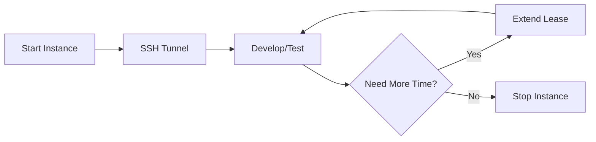
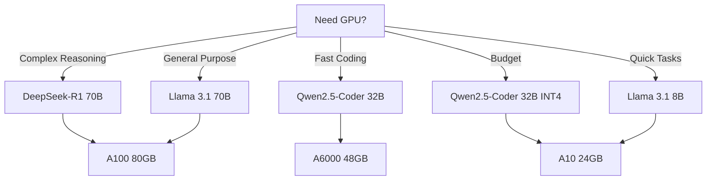

# User Guides

Comprehensive guides for common workflows and tasks with soong CLI.

## Getting Started

If you haven't configured soong yet, start with the [Quick Start](../getting-started/quick-start.md) guide.

## Available Guides

### Core Workflows

- **[Launching Instances](launching-instances.md)** - Start GPU instances with the right configuration
- **[Managing Leases](managing-leases.md)** - Monitor and extend your instance leases
- **[SSH Tunneling](ssh-tunneling.md)** - Access remote services securely through SSH tunnels

### Configuration and Optimization

- **[Model Management](model-management.md)** - Choose, configure, and add custom models
- **[Cost Optimization](cost-optimization.md)** - Strategies to minimize GPU costs

## Quick Navigation

**I want to...**

- Launch a new instance → [Launching Instances](launching-instances.md)
- Check how much time I have left → [Managing Leases](managing-leases.md#checking-lease-status)
- Access web services on my instance → [SSH Tunneling](ssh-tunneling.md)
- Add a custom model → [Model Management](model-management.md#adding-custom-models)
- Save money on GPU costs → [Cost Optimization](cost-optimization.md)

## Common Use Cases

### Development Workflow

1. [Launch an instance](launching-instances.md) with your preferred model and GPU
2. [Start SSH tunnel](ssh-tunneling.md#starting-a-tunnel) to access services
3. Develop and test your application
4. [Monitor lease time](managing-leases.md#checking-lease-status) periodically
5. [Extend if needed](managing-leases.md#extending-leases) or [stop when done](managing-leases.md#stopping-instances)

### Model Selection Strategy

See [Model Management](model-management.md) for detailed model comparisons.

## Cost Control Features

soong includes several safety mechanisms to prevent runaway costs:

1. **Lease System** - All instances have a maximum 8-hour lease
2. **Idle Detection** - Automatic shutdown after 30 minutes of inactivity
3. **Cost Confirmations** - Preview costs before launching or extending
4. **Lease Extensions** - Explicit action required to keep instances running

Learn more in [Cost Optimization](cost-optimization.md).

## Troubleshooting

Common issues and solutions:

- **SSH tunnel won't start**: Check [SSH Tunneling Guide](ssh-tunneling.md#troubleshooting)
- **Instance won't launch**: See [Launching Instances](launching-instances.md#troubleshooting)
- **Lease expired unexpectedly**: Review [Managing Leases](managing-leases.md#auto-shutdown-behavior)

## Next Steps

- Review the [CLI Reference](../reference/cli-commands.md) for all available commands
- Read about [Architecture](../architecture/index.md) to understand how it works
