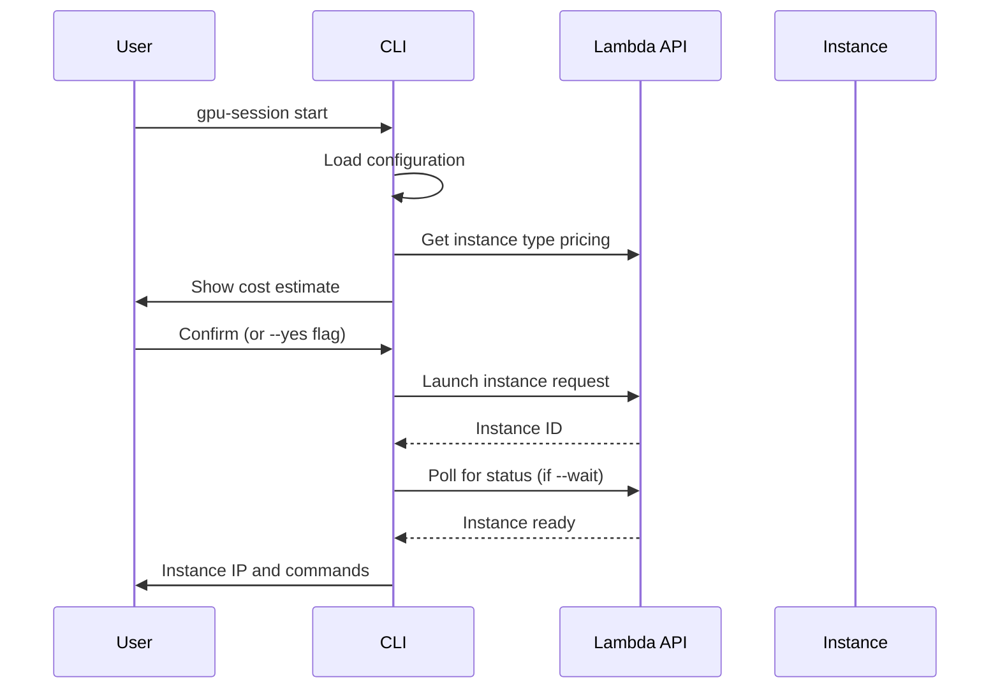

# Launching Instances

Launch Lambda Labs GPU instances with the optimal configuration for your workload.

## Quick Start

Launch with default settings:

```bash
gpu-session start
```

This uses your configured defaults for model, GPU type, region, and lease duration.

## Customizing Launch Parameters

### Selecting a Model

Override the default model with `--model`:

```bash
gpu-session start --model deepseek-r1-70b
```

Available models:

| Model | Parameters | Use Case | Min GPU |
|-------|-----------|----------|---------|
| `deepseek-r1-70b` | 70B (INT4) | Complex reasoning | A100 80GB |
| `qwen2.5-coder-32b` | 32B (FP16) | Fast coding, long context | A6000 48GB |
| `qwen2.5-coder-32b-int4` | 32B (INT4) | Budget coding | A10 24GB |
| `llama-3.1-70b` | 70B (INT4) | General purpose | A100 80GB |
| `llama-3.1-8b` | 8B (FP16) | Simple tasks | A10 24GB |

See [Model Management](model-management.md) for detailed comparisons.

### Choosing a GPU Type

Override the default GPU with `--gpu`:

```bash
gpu-session start --model qwen2.5-coder-32b --gpu gpu_1x_a6000
```

!!! tip "GPU Selection"
    The configure wizard recommends the cheapest GPU that fits your model. You can always select a larger GPU, but it will cost more.

Common GPU types:

```bash
# Budget
gpu_1x_a10          # 24GB VRAM - cheapest
gpu_1x_rtx6000      # 48GB VRAM - mid-range

# High Performance
gpu_1x_a100_sxm4_80gb  # 80GB VRAM - large models
gpu_1x_h100_pcie       # 80GB VRAM - fastest
```

### Selecting a Region

Override the default region with `--region`:

```bash
gpu-session start --region us-west-2
```

Available regions depend on GPU availability. Common regions:

- `us-west-1` (Northern California)
- `us-west-2` (Oregon)
- `us-east-1` (Virginia)
- `us-south-1` (Texas)

!!! note "Region Availability"
    GPU availability varies by region. Use `gpu-session available` to see current capacity.

### Setting Lease Duration

Set lease duration (1-8 hours) with `--hours`:

```bash
gpu-session start --hours 6
```

!!! warning "Lease Limits"
    Maximum lease duration is 8 hours. After that, you must explicitly extend the lease or the instance will auto-terminate.

### Naming Your Instance

Assign a custom name with `--name`:

```bash
gpu-session start --name "feature-branch-testing"
```

Names help identify instances when running multiple sessions.

## Launch Workflow



### Cost Confirmation

Before launching, gpu-session shows an estimate:

```
┌─────────────────────────────────────┐
│ Launch Instance                     │
├─────────────────────────────────────┤
│                                     │
│ Cost Estimate                       │
│                                     │
│ GPU: 1x A6000 (48 GB)              │
│ Rate: $0.80/hour                   │
│ Duration: 4 hours                  │
│                                     │
│ Estimated cost: $3.20              │
│                                     │
└─────────────────────────────────────┘
? Proceed with launch? (Y/n)
```

Skip confirmation with `--yes`:

```bash
gpu-session start --yes
```

### Waiting for Instance Ready

By default, the CLI waits for the instance to be ready:

```bash
gpu-session start --wait  # default behavior
```

Skip waiting to return immediately:

```bash
gpu-session start --no-wait
```

When waiting is disabled, check status manually:

```bash
gpu-session status
```

## Examples

### Scenario: Deep Reasoning Task

Launch the most capable reasoning model:

```bash
gpu-session start \
  --model deepseek-r1-70b \
  --gpu gpu_1x_a100_sxm4_80gb \
  --hours 4 \
  --name "debug-complex-issue"
```

**Cost**: ~$12-16 for 4 hours (depending on region pricing)

### Scenario: Fast Iteration Coding

Use a fast, budget-friendly coding model:

```bash
gpu-session start \
  --model qwen2.5-coder-32b-int4 \
  --gpu gpu_1x_a10 \
  --hours 2 \
  --name "rapid-prototyping"
```

**Cost**: ~$1.20-1.60 for 2 hours

### Scenario: Long Context Refactoring

Use Qwen with 32K context window:

```bash
gpu-session start \
  --model qwen2.5-coder-32b \
  --gpu gpu_1x_a6000 \
  --hours 6 \
  --name "large-file-refactor"
```

**Cost**: ~$4.80-6.00 for 6 hours

## After Launch

Once launched, the CLI displays:

```
Instance launched: a1b2c3d4
Instance ready at 123.45.67.89

SSH: gpu-session ssh
Status: gpu-session status
```

Next steps:

1. **[Start SSH tunnel](ssh-tunneling.md)** to access services
2. **[Check status](managing-leases.md#checking-lease-status)** to monitor lease time
3. **[Extend lease](managing-leases.md#extending-leases)** if you need more time

## Troubleshooting

### No Capacity Available

```
Error launching instance: No capacity available in us-west-1
```

**Solutions**:

1. Try a different region:
   ```bash
   gpu-session start --region us-west-2
   ```

2. Check current availability:
   ```bash
   gpu-session available
   ```

3. Try a different GPU type (if model allows):
   ```bash
   gpu-session start --gpu gpu_1x_rtx6000
   ```

### SSH Keys Not Found

```
Error: No SSH keys found in Lambda account
Add an SSH key at: https://cloud.lambdalabs.com/ssh-keys
```

**Solution**: Add your SSH public key to Lambda Labs:

1. Go to https://cloud.lambdalabs.com/ssh-keys
2. Click "Add SSH Key"
3. Paste your public key (`~/.ssh/id_rsa.pub`)
4. Try launching again

### Instance Launch Timeout

```
Instance launch timed out
```

**Solutions**:

1. Check instance status manually:
   ```bash
   gpu-session status
   ```

2. The instance may still be initializing. Wait 1-2 minutes and check again.

3. If stuck in "booting" state for >5 minutes, terminate and relaunch:
   ```bash
   gpu-session stop --yes
   gpu-session start
   ```

### Cost Estimate Shows Different Price

Cost estimates are based on current Lambda Labs pricing, which can change. The estimate shown is for the **lease duration**, not the hourly rate.

**Example**:
```
Rate: $1.20/hour
Duration: 4 hours
Estimated cost: $4.80  # 4 × $1.20
```

!!! warning "Actual Costs"
    If you extend your lease or the instance runs beyond the lease (before auto-termination), costs will increase. Always monitor with `gpu-session status`.

## Best Practices

### Choose the Right Model

- **Complex reasoning**: DeepSeek-R1 70B
- **Fast coding**: Qwen2.5-Coder 32B
- **Budget coding**: Qwen2.5-Coder 32B INT4
- **Simple tasks**: Llama 3.1 8B

See [Model Management](model-management.md) for detailed guidance.

### Start with Shorter Leases

Begin with 2-4 hours and extend if needed. This prevents paying for unused time.

```bash
# Start short
gpu-session start --hours 2

# Extend later if needed
gpu-session extend 2
```

### Use --yes for Automation

When scripting or automating launches:

```bash
gpu-session start --yes --no-wait
```

### Set Meaningful Names

Use descriptive names for multi-instance workflows:

```bash
gpu-session start --name "frontend-dev-server"
gpu-session start --name "backend-api-server"
gpu-session start --name "ml-training-job"
```

## Next Steps

- [Set up SSH tunneling](ssh-tunneling.md) to access services
- [Monitor your lease](managing-leases.md) to avoid unexpected termination
- [Optimize costs](cost-optimization.md) with smart GPU selection
