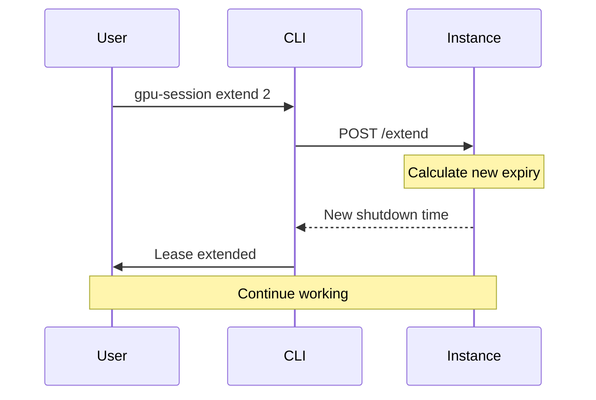

# Managing Leases

Monitor, extend, and understand the lease system that prevents runaway GPU costs.

## Overview

Every GPU instance has a **lease** that defines how long it can run. Leases have these key properties:

- **Maximum duration**: 8 hours
- **Default duration**: 4 hours (configurable)
- **Extensions**: Allowed up to 8-hour total
- **Auto-termination**: Instance stops when lease expires

!!! info "Why Leases?"
    Leases prevent accidentally leaving expensive GPU instances running indefinitely. You must explicitly extend to keep working.

## Checking Lease Status

View all running instances and their lease status:

```bash
gpu-session status
```

### Status Output

```
┌─────────────────────────────────────────────────────────────────────┐
│                           GPU Instances                             │
├────────┬──────────┬────────┬──────────┬────────┬────────┬──────────┤
│ ID     │ Name     │ Status │ IP       │ GPU    │ Uptime │ Time Left│
├────────┼──────────┼────────┼──────────┼────────┼────────┼──────────┤
│ a1b2c3 │ dev-work │ active │ 1.2.3.4  │ a6000  │ 2h 15m │ 1h 45m   │
└────────┴──────────┴────────┴──────────┴────────┴────────┴──────────┘
```

### Understanding Status Fields

| Field | Description |
|-------|-------------|
| **ID** | First 8 chars of instance ID |
| **Name** | Custom name (if set) |
| **Status** | Instance state (active, booting, terminated) |
| **IP** | Public IP address |
| **GPU** | GPU type |
| **Uptime** | Time since instance started |
| **Time Left** | Time until lease expires |

### Time Left Indicators

Time remaining is color-coded:

- **Green**: More than 1 hour remaining
- **Yellow**: Less than 1 hour remaining
- **Red**: Lease expired (instance may still be running briefly)

```bash
# Examples
1h 45m      # Green - plenty of time
45m         # Yellow - less than 1 hour
EXPIRED     # Red - lease expired
```

## Cost Tracking

Status also shows cost information:

```bash
gpu-session status
```

```
┌────────────────────────────────────────────────────────────────────────────┐
│                             GPU Instances                                  │
├──────┬─────┬────────┬─────────┬────────┬────────┬──────────┬─────────────┤
│ ID   │Name │ Status │ IP      │ GPU    │ Uptime │ Cost Now │ Est. Total  │
├──────┼─────┼────────┼─────────┼────────┼────────┼──────────┼─────────────┤
│ a1b2 │ dev │ active │ 1.2.3.4 │ a6000  │ 2h 15m │ $1.80    │ $3.20       │
└──────┴─────┴────────┴─────────┴────────┴────────┴──────────┴─────────────┘
```

| Field | Description |
|-------|-------------|
| **Cost Now** | Amount spent so far (based on uptime) |
| **Est. Total** | Estimated cost if lease runs to completion |

!!! warning "Cost After Expiration"
    If your lease expires but the instance hasn't auto-terminated yet, costs continue accruing. The "Cost Now" field turns red to indicate this.

## Extending Leases

Extend an active instance to add more time:

```bash
gpu-session extend 2  # Add 2 hours
```

### Extension Limits

- **Maximum total lease**: 8 hours
- **Minimum extension**: 1 hour
- **Maximum extension**: Up to 8-hour total limit

```bash
# Current lease: 4 hours
# Uptime: 3 hours
# Remaining: 1 hour
# Max extension: 4 hours (to reach 8-hour total)

gpu-session extend 4  # OK - brings total to 8 hours
gpu-session extend 5  # Error - would exceed 8-hour limit
```

### Extension Cost Confirmation

Before extending, you'll see a cost estimate:

```
┌─────────────────────────────────────┐
│ Extend Lease                        │
├─────────────────────────────────────┤
│                                     │
│ Extension Cost Estimate             │
│                                     │
│ Instance: a1b2c3d4                 │
│ GPU: 1x A6000 (48 GB)              │
│ Rate: $0.80/hour                   │
│ Extension: 2 hours                 │
│                                     │
│ Additional cost: $1.60             │
│                                     │
└─────────────────────────────────────┘
? Extend lease by 2 hours? (Y/n)
```

Skip confirmation with `--yes`:

```bash
gpu-session extend 2 --yes
```

### Extension Workflow



## Auto-Shutdown Behavior

Instances automatically terminate when:

1. **Lease expires** - 8-hour maximum reached
2. **Idle timeout** - 30 minutes of no activity
3. **Manual stop** - You run `gpu-session stop`

### Idle Detection

The status daemon monitors system activity and will auto-terminate after 30 minutes of inactivity:

- **Monitored metrics**:
  - CPU usage
  - GPU utilization
  - Network activity
  - Active SSH sessions

- **Grace period**: 30 minutes
- **Warning**: None (automatic)

!!! tip "Keep Alive"
    If running long-running tasks (training, batch jobs), ensure they generate GPU activity to prevent idle shutdown.

### Lease Expiration Process

When a lease expires:

1. **T-0**: Lease expires
2. **T+5min**: Instance begins shutdown sequence
3. **T+10min**: Instance terminates

!!! warning "No Grace Period for Leases"
    Unlike idle timeout, lease expiration has **no grace period**. Extend before the lease expires.

## Stopping Instances

Manually terminate an instance:

```bash
gpu-session stop
```

With confirmation:

```
? Terminate instance a1b2c3d4e5f6? (y/N)
```

Skip confirmation with `--yes`:

```bash
gpu-session stop --yes
```

!!! danger "Unsaved Work"
    Stopping an instance terminates it immediately. Ensure all work is saved to the persistent filesystem (`/home/ubuntu/workspace`) before stopping.

## Viewing History

### Termination History

View why instances were terminated:

```bash
gpu-session status --history
```

```
┌──────────────────────────────────────────────────────────────────────┐
│                  Termination History (Last 24 Hours)                 │
├────────────┬─────────┬────────────────────┬────────┬────────┬────────┤
│ Time       │ Inst ID │ Reason             │ Uptime │ GPU    │ Region │
├────────────┼─────────┼────────────────────┼────────┼────────┼────────┤
│ 2025-01-01 │ a1b2c3  │ Lease expired      │ 8h 5m  │ a6000  │ us-w-1 │
│ 2024-12-31 │ x9y8z7  │ Idle timeout       │ 2h 45m │ a10    │ us-w-1 │
│ 2024-12-31 │ m5n6o7  │ Manual termination │ 3h 12m │ a100   │ us-e-1 │
└────────────┴─────────┴────────────────────┴────────┴────────┴────────┘
```

Adjust time window:

```bash
gpu-session status --history --history-hours 48  # Last 48 hours
```

### Stopped Instances

View recently stopped instances:

```bash
gpu-session status --stopped
```

```
┌───────────────────────────────────────────────────────────────────┐
│                         Stopped Instances                         │
├─────────┬────────┬──────────┬────────┬────────┬──────────────────┤
│ Inst ID │ Name   │ Status   │ GPU    │ Region │ Created At       │
├─────────┼────────┼──────────┼────────┼────────┼──────────────────┤
│ a1b2c3  │ dev-1  │ termin'd │ a6000  │ us-w-1 │ 2025-01-01 10:30 │
│ x9y8z7  │ test-2 │ stopped  │ a10    │ us-w-1 │ 2024-12-31 14:20 │
└─────────┴────────┴──────────┴────────┴────────┴──────────────────┘
```

## Best Practices

### Monitor Regularly

Check status every hour during active development:

```bash
# Add to your workflow
watch -n 3600 gpu-session status  # Check every hour
```

Or set up a terminal status bar:

```bash
# Simple status check
alias gpu-status='gpu-session status'
```

### Extend Proactively

Don't wait until the last minute:

```bash
# When you see < 1 hour remaining
Time Left: 45m  # Yellow warning

# Extend immediately
gpu-session extend 2
```

### Save Work to Persistent Storage

The persistent filesystem survives instance termination:

```bash
# Always work in workspace
cd /home/ubuntu/workspace

# Or symlink projects
ln -s /home/ubuntu/workspace/my-project ~/my-project
```

Files outside `/home/ubuntu/workspace` are **lost** when the instance terminates.

### Use Multiple Short Leases

Instead of one 8-hour lease, use multiple shorter sessions:

```bash
# Session 1: 2-4 hours
gpu-session start --hours 2
# ... work ...
gpu-session stop

# Session 2: 2-4 hours (later)
gpu-session start --hours 2
# ... more work ...
```

**Benefits**:
- Pay only for actual usage
- Fresh instance state
- Lower risk of data loss

## Troubleshooting

### Lease Extended but Still Shows Old Time

Status may be cached. Wait 10-30 seconds and check again:

```bash
sleep 30 && gpu-session status
```

### Can't Extend (Already at 8 Hours)

```
Error extending lease: Maximum lease duration reached (8 hours)
```

**Solution**: You must stop the current instance and start a new one:

```bash
gpu-session stop --yes
gpu-session start --hours 4
```

### Instance Terminated Unexpectedly

Check termination history to see why:

```bash
gpu-session status --history
```

Common reasons:

- **Lease expired**: You didn't extend in time
- **Idle timeout**: No activity for 30 minutes
- **Manual termination**: You or someone else ran `stop`

### Cost Still Increasing After Expiration

If the lease shows "EXPIRED" but cost is still increasing (red), the instance hasn't auto-terminated yet. Manually stop it:

```bash
gpu-session stop --yes
```

## Next Steps

- [Set up SSH tunneling](ssh-tunneling.md) to access services
- [Optimize costs](cost-optimization.md) with smart lease management
- [Add custom models](model-management.md) for your workflow
