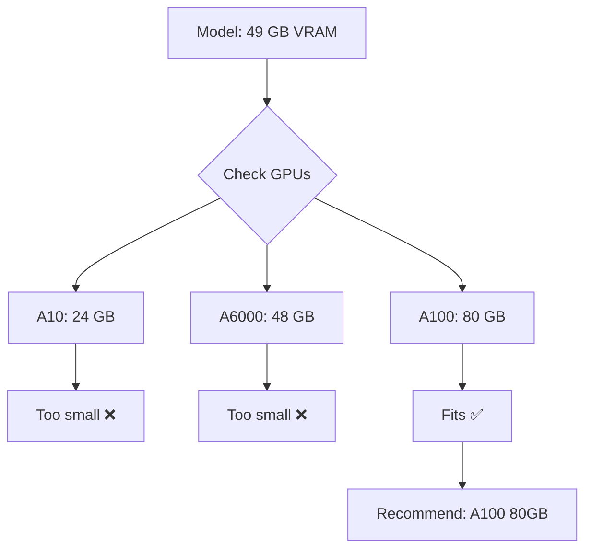
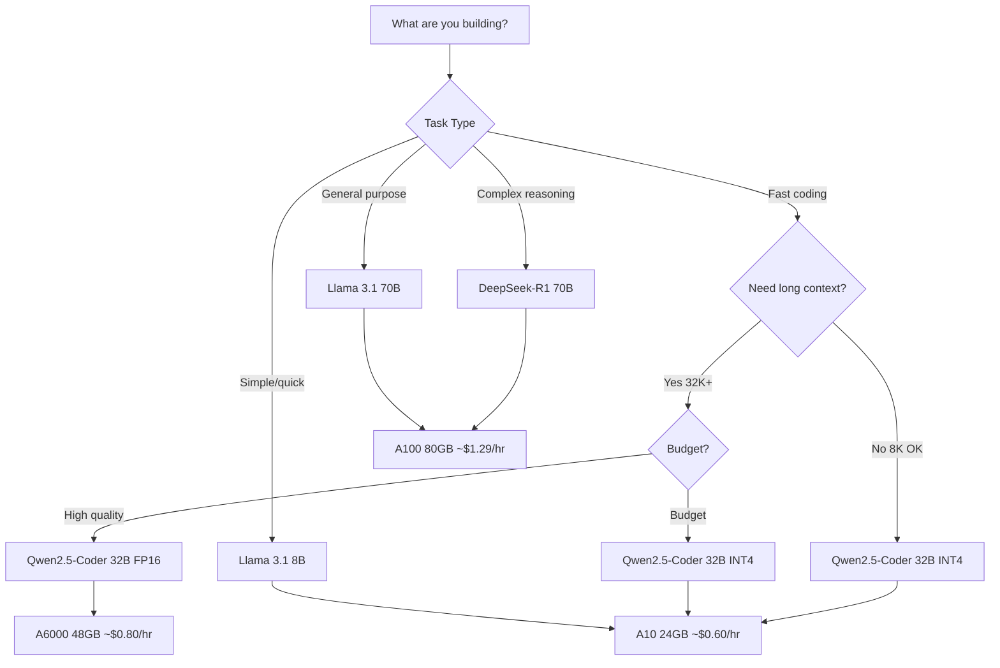

# Model Management

Choose, configure, and add custom AI models for your GPU instances.

## Overview

soong supports multiple AI models with different characteristics:

- **Pre-configured models**: Ready to use with known VRAM requirements
- **Custom models**: Add your own models with manual VRAM calculation
- **GPU recommendations**: Automatic matching of models to GPUs

## Listing Models

View all available models:

```bash
soong models
```

```
┌───────────────────────────────────────────────────────────────────────┐
│                          Available Models                             │
├──────────────────────┬────────┬───────┬──────┬──────────────────────┤
│ ID                   │ Params │ Quant │ VRAM │ Min GPU              │
├──────────────────────┼────────┼───────┼──────┼──────────────────────┤
│ llama-3.1-8b         │ 8B     │ FP16  │ 22GB │ 1x A10 (24 GB)       │
│ qwen2.5-coder-32b... │ 32B    │ INT4  │ 26GB │ 1x A6000 (48 GB)     │
│ qwen2.5-coder-32b    │ 32B    │ FP16  │ 46GB │ 1x A6000 (48 GB)     │
│ codellama-34b        │ 34B    │ FP16  │ 48GB │ 1x A6000 (48 GB)     │
│ deepseek-r1-70b      │ 70B    │ INT4  │ 49GB │ 1x A100 SXM4 (80 GB) │
│ llama-3.1-70b        │ 70B    │ INT4  │ 49GB │ 1x A100 SXM4 (80 GB) │
│ mistral-7b           │ 7B     │ FP16  │ 21GB │ 1x A10 (24 GB)       │
└──────────────────────┴────────┴───────┴──────┴──────────────────────┘
```

Models are sorted by VRAM requirement (cheapest first).

## Model Details

Get comprehensive information about a specific model:

```bash
soong models info deepseek-r1-70b
```

```
┌───────────────────────────────────┐
│      DeepSeek-R1 70B              │
└───────────────────────────────────┘

HuggingFace Path: deepseek-ai/DeepSeek-R1-Distill-Llama-70B
Parameters: 70B
Quantization: INT4
Context Length: 8,192 tokens

VRAM Breakdown:
  Base weights:       35.0 GB
  KV cache:            4.0 GB
  Overhead:            2.0 GB
  Activations:         3.5 GB
  Total estimated:    49.0 GB

Recommended GPU: 1x A100 SXM4 (80 GB)
  Price: $1.29/hour

Good for:
  • Complex multi-step reasoning
  • Debugging difficult issues
  • Architecture decisions
  • Code review with explanations

Not good for:
  • Simple/quick tasks (overkill)
  • Long context windows (8K limit)
  • Speed-critical applications

Notes: Chain-of-thought reasoning. Slower but more accurate.
```

## Model Comparison

### DeepSeek-R1 70B

**Best for**: Complex reasoning tasks

```yaml
Parameters: 70B (INT4)
VRAM: ~49 GB
Min GPU: A100 80GB
Context: 8K tokens
Cost: ~$1.29/hour
```

**Strengths**:
- Chain-of-thought reasoning
- Debugging complex issues
- Architecture decisions
- Code review with detailed explanations

**Weaknesses**:
- Overkill for simple tasks
- Limited context window (8K)
- Slower inference

**Use when**: You need maximum reasoning capability and accuracy matters more than speed.

### Qwen2.5-Coder 32B

**Best for**: Fast coding with long context

```yaml
Parameters: 32B (FP16)
VRAM: ~46 GB
Min GPU: A6000 48GB
Context: 32K tokens
Cost: ~$0.80/hour
```

**Strengths**:
- Purpose-built for code
- 4x longer context (32K vs 8K)
- Fast inference
- Multi-language support

**Weaknesses**:
- Less reasoning capability than DeepSeek
- Not ideal for non-coding tasks
- Limited world knowledge

**Use when**: You're refactoring large files or need long context for code generation.

### Qwen2.5-Coder 32B INT4

**Best for**: Budget-friendly coding

```yaml
Parameters: 32B (INT4)
VRAM: ~26 GB
Min GPU: A10 24GB
Context: 32K tokens
Cost: ~$0.60/hour
```

**Strengths**:
- 50% cheaper than FP16 version
- Same 32K context window
- Runs on cheaper GPUs
- Good quality/cost ratio

**Weaknesses**:
- ~5% quality loss vs FP16
- Slightly less accurate for complex code

**Use when**: Cost is a concern and you can tolerate minor quality reduction.

### Llama 3.1 70B

**Best for**: General-purpose tasks

```yaml
Parameters: 70B (INT4)
VRAM: ~49 GB
Min GPU: A100 80GB
Context: 8K tokens
Cost: ~$1.29/hour
```

**Strengths**:
- Broad task coverage
- Excellent instruction following
- Good for writing and documentation
- Balanced code + general knowledge

**Weaknesses**:
- Not specialized for coding
- Not specialized for reasoning
- Jack of all trades, master of none

**Use when**: You need a single model for diverse tasks (code, writing, analysis).

### Llama 3.1 8B

**Best for**: Quick, simple tasks

```yaml
Parameters: 8B (FP16)
VRAM: ~22 GB
Min GPU: A10 24GB
Context: 8K tokens
Cost: ~$0.60/hour
```

**Strengths**:
- Fastest inference
- Cheapest option
- Good for simple code changes
- Rapid iteration

**Weaknesses**:
- Limited reasoning
- Struggles with complex tasks
- Smaller knowledge base

**Use when**: Speed and cost matter more than quality for straightforward tasks.

## Adding Custom Models

Add models not in the pre-configured list:

### Interactive Mode

```bash
soong models add
```

The CLI prompts for details:

```
Add Custom Model

? Model name/ID: mistral-nemo-12b
? HuggingFace model path: mistralai/Mistral-Nemo-Instruct-2407
? Parameter count (billions): 12
? Quantization: FP16 (2 bytes/param)
? Context length: 128000

Estimated VRAM: 32.5 GB
Minimum GPU: 40 GB

Model 'mistral-nemo-12b' added successfully!
```

### Flag Mode

For scripting, use flags:

```bash
soong models add \
  --name mistral-nemo-12b \
  --hf-path mistralai/Mistral-Nemo-Instruct-2407 \
  --params 12 \
  --quantization fp16 \
  --context 128000
```

### Quantization Options

| Quantization | Bytes/Param | Use Case |
|-------------|-------------|----------|
| **FP32** | 4.0 | Research, maximum precision |
| **FP16** | 2.0 | Production, good quality |
| **INT8** | 1.0 | Efficient, minor quality loss |
| **INT4** | 0.5 | Budget, ~5% quality loss |

## VRAM Calculation

Understanding how VRAM is estimated:

```
Total VRAM = Base Weights + KV Cache + Overhead + Activations
```

### Components

**Base Weights**:
```
params_billions × quantization_bytes_per_param
```

Example: 70B model at INT4 (0.5 bytes/param)
```
70 × 0.5 = 35 GB
```

**KV Cache**:
```
min(4.0, context_length / 2048)
```

Example: 8K context
```
8192 / 2048 = 4.0 GB
```

**Overhead**:
```
2 GB (CUDA, framework, etc.)
```

**Activations**:
```
base_weights × 0.1
```

Example: 35 GB base
```
35 × 0.1 = 3.5 GB
```

**Total**:
```
35 + 4 + 2 + 3.5 = 44.5 GB
```

### Safety Margin

Recommended GPU sizes include a 10% headroom:

```
estimated_vram × 1.1 ≤ gpu_vram
```

For 44.5 GB estimated, minimum 48 GB GPU recommended (A6000).

## GPU Recommendations

soong automatically recommends the **cheapest GPU** that fits a model:



### GPU VRAM Sizes

| GPU | VRAM | Typical Use |
|-----|------|-------------|
| A10 | 24 GB | Small models (≤20 GB) |
| A100 40GB | 40 GB | Medium models (≤36 GB) |
| A6000 | 48 GB | Medium-large models (≤43 GB) |
| RTX 6000 | 48 GB | Same as A6000 |
| A100 80GB | 80 GB | Large models (≤72 GB) |
| H100 | 80 GB | Large models, fastest |

## Removing Custom Models

Delete a custom model from configuration:

```bash
soong models remove mistral-nemo-12b
```

With confirmation:

```
? Remove custom model 'mistral-nemo-12b'? (y/N)
```

Skip confirmation with `--yes`:

```bash
soong models remove mistral-nemo-12b --yes
```

!!! warning "Built-in Models"
    You cannot remove pre-configured models (like `deepseek-r1-70b`). Only custom models can be removed.

## Model Selection Strategy



### Decision Matrix

| Scenario | Model | GPU | Est. Cost |
|----------|-------|-----|-----------|
| Debugging hard issue | DeepSeek-R1 70B | A100 80GB | $1.29/hr |
| Refactoring large files | Qwen2.5-Coder 32B | A6000 48GB | $0.80/hr |
| Budget coding | Qwen2.5-Coder 32B INT4 | A10 24GB | $0.60/hr |
| Documentation writing | Llama 3.1 70B | A100 80GB | $1.29/hr |
| Quick code fix | Llama 3.1 8B | A10 24GB | $0.60/hr |

## Best Practices

### Start with Defaults

Use pre-configured models first:

```bash
soong start --model qwen2.5-coder-32b
```

Only add custom models when necessary.

### Verify HuggingFace Paths

Before adding a custom model, check it exists:

```bash
# Visit HuggingFace
https://huggingface.co/mistralai/Mistral-Nemo-Instruct-2407
```

### Use INT4 for Budget

When cost is a concern, use INT4 quantization:

```bash
# Instead of FP16 (46 GB, $0.80/hr)
soong start --model qwen2.5-coder-32b

# Use INT4 (26 GB, $0.60/hr)
soong start --model qwen2.5-coder-32b-int4
```

Quality loss is typically ~5%, acceptable for most tasks.

### Match Context to Task

Don't pay for unused context:

- **8K context**: Most tasks (99% of code files)
- **32K context**: Large file refactoring, documentation
- **128K+ context**: Entire codebases (rare)

### Test Before Adding Custom Models

Before adding a custom model permanently:

```bash
# Test with SGLang directly on instance
soong ssh

ubuntu@instance:~$ python -m sglang.launch_server \
  --model mistralai/Mistral-Nemo-Instruct-2407 \
  --port 8000

# Monitor VRAM usage
ubuntu@instance:~$ nvidia-smi
```

If it works, then add to config.

## Troubleshooting

### Model Not Found

```
Error: Model 'custom-model' not found.
Use 'soong models' to see available models.
```

**Solution**: List models and check spelling:

```bash
soong models
```

### Invalid Quantization

```
Error: Invalid quantization 'fp8'. Must be one of: fp32, fp16, int8, int4
```

**Solution**: Use a valid quantization level:

```bash
soong models add \
  --name my-model \
  --quantization fp16  # Valid
```

### GPU Too Small

During launch:

```
Warning: Selected GPU has 24GB but model needs ~46GB
```

**Solution**: Use a larger GPU:

```bash
soong start --model qwen2.5-coder-32b --gpu gpu_1x_a6000
```

Or use a quantized version:

```bash
soong start --model qwen2.5-coder-32b-int4  # Needs only 26GB
```

### Model Won't Load on Instance

After launching, model fails to load:

```bash
# On instance
OutOfMemoryError: CUDA out of memory
```

**Causes**:

1. VRAM estimate was too low
2. Other processes using GPU memory
3. Model requires more overhead than estimated

**Solutions**:

1. Increase VRAM estimate in custom model:
   ```bash
   soong models remove my-model
   soong models add --params 35  # Was 32, bump up
   ```

2. Use a larger GPU or INT4 quantization

3. Check for memory leaks:
   ```bash
   ubuntu@instance:~$ nvidia-smi
   ```

## Next Steps

- [Launch instances](launching-instances.md) with your chosen model
- [Optimize costs](cost-optimization.md) by selecting the right model/GPU combo
- [Manage leases](managing-leases.md) to maximize model uptime
