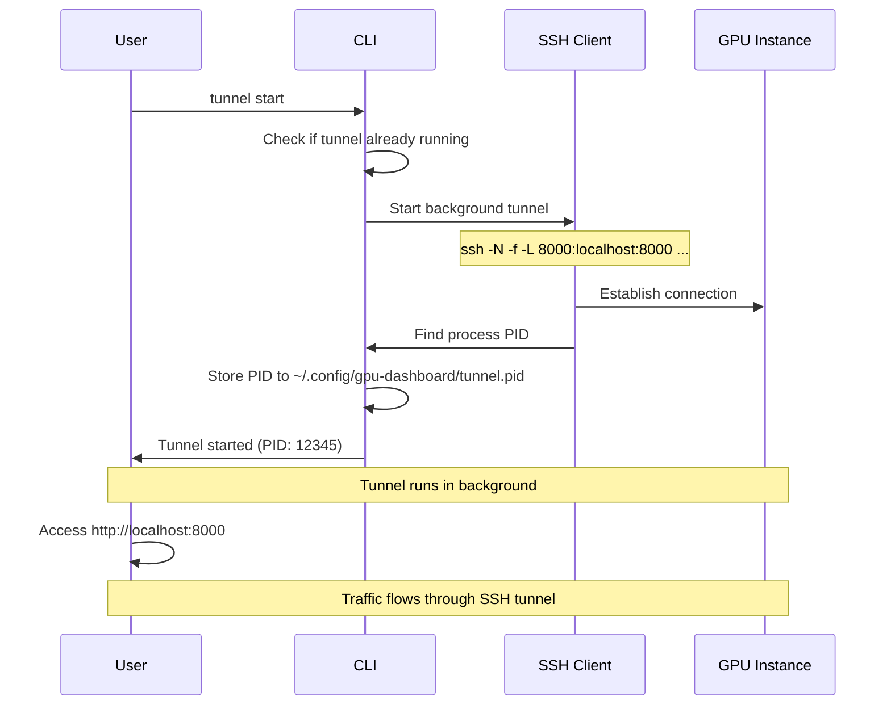

# SSH Tunneling

Securely access remote services running on your GPU instance through SSH port forwarding.

## Overview

SSH tunneling creates encrypted connections from your local machine to services running on the GPU instance:

```
Your Computer                GPU Instance
localhost:8000  <---SSH--->  remote:8000 (SGLang API)
localhost:5678  <---SSH--->  remote:5678 (n8n)
localhost:8080  <---SSH--->  remote:8080 (Status Daemon)
```

All traffic flows through a single encrypted SSH connection, eliminating the need to expose ports publicly.

## Quick Start

Start a tunnel to your active instance:

```bash
soong tunnel start
```

This forwards three ports by default:

| Local Port | Remote Service | Purpose |
|-----------|----------------|---------|
| `8000` | SGLang API | Model inference endpoint |
| `5678` | n8n | Workflow automation UI |
| `8080` | Status Daemon | Instance monitoring API |

## Starting a Tunnel

### Basic Usage

```bash
soong tunnel start
```

The tunnel runs in the **background** as a daemon process:

```
Starting SSH tunnel to 123.45.67.89...
SSH tunnel started (PID: 12345)
  localhost:8000 -> 123.45.67.89:8000
  localhost:5678 -> 123.45.67.89:5678
  localhost:8080 -> 123.45.67.89:8080
```

!!! info "Background Process"
    The tunnel uses `ssh -N -f` to fork into the background. It will persist until explicitly stopped or your machine reboots.

### Custom Ports

Override default ports:

```bash
soong tunnel start \
  --sglang-port 8001 \
  --n8n-port 5679 \
  --status-port 8081
```

This is useful when local ports are already in use.

### Specify Instance

Connect to a specific instance (when running multiple):

```bash
soong tunnel start --instance-id a1b2c3d4
```

## How It Works



### SSH Command Details

The tunnel uses these SSH flags:

```bash
ssh -N -f \
  -o StrictHostKeyChecking=no \
  -o UserKnownHostsFile=/dev/null \
  -o ServerAliveInterval=60 \
  -L 8000:localhost:8000 \
  -L 5678:localhost:5678 \
  -L 8080:localhost:8080 \
  -i ~/.ssh/id_rsa \
  ubuntu@123.45.67.89
```

| Flag | Purpose |
|------|---------|
| `-N` | No remote command (just forwarding) |
| `-f` | Fork to background after authentication |
| `-L` | Local port forwarding specification |
| `-o ServerAliveInterval=60` | Keep connection alive with heartbeat |
| `-i` | SSH private key for authentication |

### PID Management

The tunnel process ID (PID) is stored in:

```
~/.config/gpu-dashboard/tunnel.pid
```

This allows the CLI to:

- Check if a tunnel is already running
- Stop the tunnel by PID
- Prevent duplicate tunnels

## Accessing Services

Once the tunnel is running, access services at localhost URLs:

### SGLang API (Port 8000)

```bash
curl http://localhost:8000/v1/models
```

```bash
curl http://localhost:8000/v1/completions \
  -H "Content-Type: application/json" \
  -d '{
    "model": "qwen2.5-coder-32b",
    "prompt": "def fibonacci(n):",
    "max_tokens": 100
  }'
```

### n8n Workflow UI (Port 5678)

Open in browser:

```
http://localhost:5678
```

### Status Daemon API (Port 8080)

```bash
# Get instance status
curl http://localhost:8080/status \
  -H "Authorization: Bearer YOUR_TOKEN"

# Extend lease
curl -X POST http://localhost:8080/extend \
  -H "Authorization: Bearer YOUR_TOKEN" \
  -d "hours=2"
```

## Checking Tunnel Status

```bash
soong tunnel status
```

**Output**:

```
Tunnel is running
```

or

```
Tunnel is not running
```

## Stopping a Tunnel

```bash
soong tunnel stop
```

This terminates the background SSH process:

```
Stopped tunnel (PID: 12345)
```

The PID file (`~/.config/gpu-dashboard/tunnel.pid`) is also removed.

!!! tip "Auto-Cleanup"
    If the tunnel process dies unexpectedly, the CLI detects the stale PID file and cleans it up automatically.

## Direct SSH Access

For interactive shell access (not tunneling), use:

```bash
soong ssh
```

This opens an interactive SSH session:

```bash
ubuntu@gpu-instance:~$ nvidia-smi
ubuntu@gpu-instance:~$ cd ~/workspace
ubuntu@gpu-instance:~$ python train.py
```

!!! note "Difference: Tunnel vs SSH"
    - **Tunnel**: Background port forwarding, no shell
    - **SSH**: Interactive shell session

## Troubleshooting

### Tunnel Already Running

```
Tunnel already running. Stop it first.
```

**Solution**: Stop the existing tunnel:

```bash
soong tunnel stop
soong tunnel start
```

### Port Already in Use

```
Error starting tunnel: bind: Address already in use
```

**Solution**: Either:

1. Stop the conflicting service on the local port, or
2. Use custom ports:

```bash
soong tunnel start --sglang-port 8001
```

### Tunnel Process Not Found

```
Tunnel process not found (already stopped?)
```

This happens when the tunnel died unexpectedly. The CLI cleans up the stale PID file automatically.

**Solution**: Start a new tunnel:

```bash
soong tunnel start
```

### SSH Connection Timeout

```
SSH tunnel command timed out
```

**Possible causes**:

1. Instance not ready yet:
   ```bash
   soong status  # Check if instance is "active"
   ```

2. Network issues or firewall blocking SSH (port 22)

3. Incorrect SSH key:
   ```bash
   soong configure  # Reconfigure SSH key path
   ```

### Can't Access localhost:8000

**Checklist**:

1. Verify tunnel is running:
   ```bash
   soong tunnel status
   ```

2. Check if service is actually running on the instance:
   ```bash
   soong ssh
   ubuntu@instance:~$ curl localhost:8000/v1/models
   ```

3. Verify firewall isn't blocking local connections:
   ```bash
   # macOS/Linux
   sudo lsof -i :8000
   ```

## Advanced Usage

### Multiple Instances

Run tunnels to multiple instances on different port ranges:

```bash
# Instance 1 (dev)
soong tunnel start \
  --instance-id a1b2c3d4 \
  --sglang-port 8000 \
  --n8n-port 5678 \
  --status-port 8080

# Instance 2 (staging)
soong tunnel start \
  --instance-id x9y8z7w6 \
  --sglang-port 8100 \
  --n8n-port 5778 \
  --status-port 8180
```

!!! warning "One Tunnel at a Time"
    The current implementation stores only one PID, so only one tunnel can be managed by `soong tunnel`. For multiple tunnels, use raw SSH commands (see below).

### Manual SSH Tunneling

For custom configurations, use SSH directly:

```bash
ssh -N -f \
  -L 8000:localhost:8000 \
  -L 5678:localhost:5678 \
  -i ~/.ssh/id_rsa \
  ubuntu@123.45.67.89
```

To stop:

```bash
# Find PID
pgrep -f "ssh.*123.45.67.89"

# Kill by PID
kill 12345
```

### Port Forwarding Patterns

**Local forwarding** (what we use):
```
-L local_port:remote_host:remote_port
```

Forward a local port to a remote destination.

**Remote forwarding**:
```
-R remote_port:local_host:local_port
```

Expose a local service on the remote instance (less common).

**Dynamic forwarding (SOCKS proxy)**:
```
-D local_port
```

Create a SOCKS proxy for routing all traffic through the instance.

## Security Considerations

### Encrypted Connection

All traffic through the tunnel is encrypted by SSH, even if the underlying service (like HTTP) is unencrypted.

```
Plaintext HTTP  →  SSH Encryption  →  SSH Decryption  →  Plaintext HTTP
(Your App)         (Tunnel)            (Tunnel)           (Remote Service)
```

### Authentication

Tunnel authentication uses your SSH private key:

```bash
~/.ssh/id_rsa  # Default location
```

!!! danger "Protect Your Private Key"
    Never share your SSH private key. It grants full access to your instances.

### Status Daemon Token

API calls to the status daemon (port 8080) require token authentication:

```bash
curl http://localhost:8080/status \
  -H "Authorization: Bearer YOUR_TOKEN"
```

The token is stored in `~/.config/soong/config.json` and auto-generated during setup.

## Best Practices

### Always Use Tunnels

Instead of exposing services publicly, use SSH tunnels:

```
✅ http://localhost:8000  # Through tunnel
❌ http://123.45.67.89:8000  # Publicly exposed
```

### Stop Tunnels When Done

Free up ports and resources:

```bash
soong tunnel stop
```

### Check Status Before Starting

Avoid port conflicts:

```bash
soong tunnel status
# If running, stop first
soong tunnel stop
soong tunnel start
```

### Use Instance-Specific Tunnels

When running multiple instances, specify which one:

```bash
soong tunnel start --instance-id a1b2c3d4
```

## Next Steps

- [Launch an instance](launching-instances.md) to tunnel to
- [Manage leases](managing-leases.md) to keep tunnels alive
- [Cost optimization](cost-optimization.md) to manage your GPU spending
